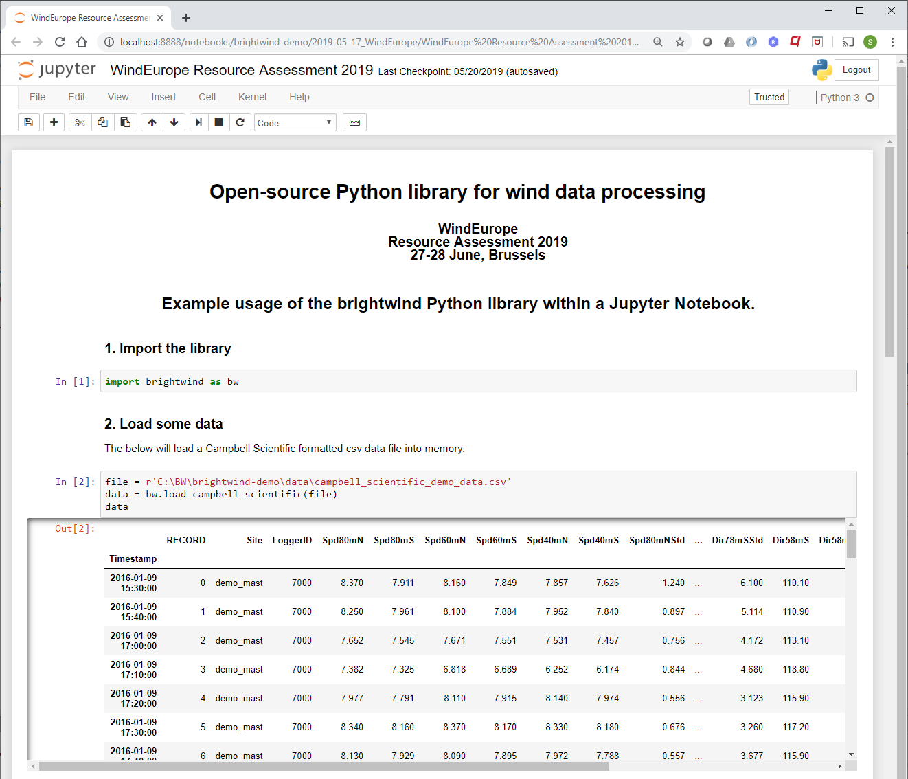
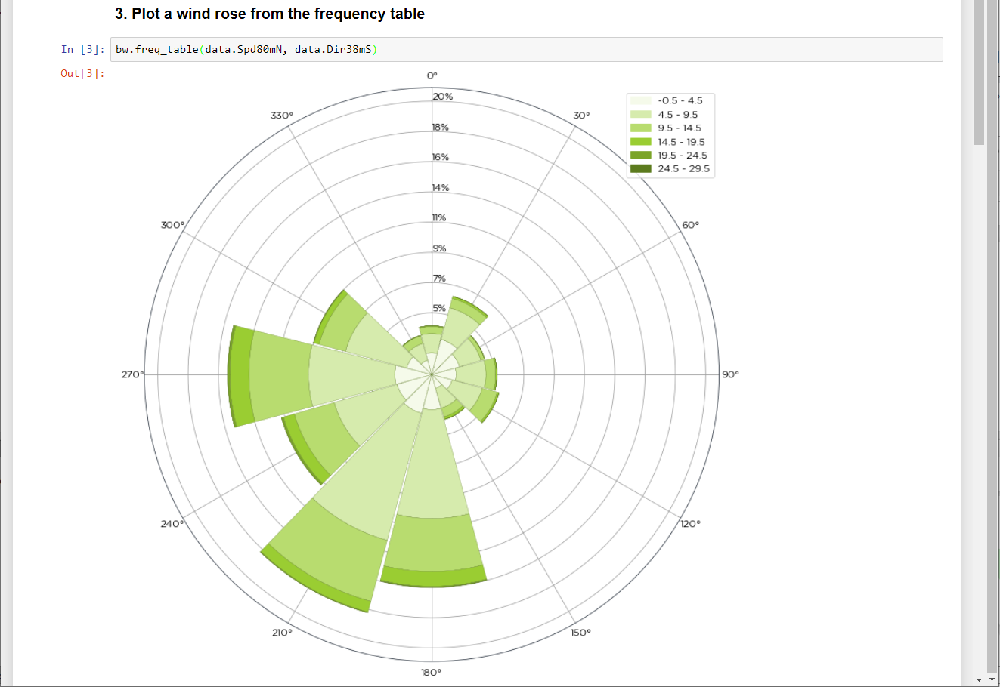

--------------
```
     __         _       __    __           _           __
    / /_  _____(_)___  / /_  / /__      __(_)___  ___ / /
   / __ \/ ___/ / __ \/ __ \/ __/ | /| / / / __ \/ __  /
  / /_/ / /  / / /_/ / / / / /_ | |/ |/ / / / / / /_/ /
 /_.___/_/  /_/\__, /_/ /_/\__/ |__/|__/_/_/ /_/\__,_/
              /____/
 ```
&nbsp;&nbsp;&nbsp;&nbsp;&nbsp;&nbsp;&nbsp;&nbsp;&nbsp;&nbsp;&nbsp;&nbsp;**A Python library primarily for wind resource assessments.**

--------------

<br>

Brightwind is an open-source Python library for wind (and solar) resource analysis. It loads meteorological
timeseries data, runs common analyses — shear, long-term adjustments, correlations, distributions — and exports
results to formats used by wind analysis software such as WAsP.

📚 **Full documentation, tutorials and API reference:** https://brightwind-dev.github.io/brightwind-docs/

<br>

---
### Installation

Install brightwind into its own environment to avoid dependency clashes. Pick whichever option suits you.

#### Option 1 — venv (quick way to try brightwind out)

Check Python is installed (3.9+ recommended):

```bash
python --version
```

If not, install it from [python.org/downloads](https://www.python.org/downloads/) — on Windows, tick **"Add
Python to PATH"** in the installer.

Then create an environment and install brightwind:

```bash
python -m venv brightwind_env
# Windows
brightwind_env\Scripts\activate
# macOS / Linux
source brightwind_env/bin/activate

pip install brightwind
```

#### Option 2 — conda

Common if you already use Anaconda or work primarily in Jupyter.
[Anaconda](https://www.datacamp.com/tutorial/installing-anaconda-windows) bundles Python, pip and Jupyter in one
installer. From the **Anaconda Prompt**:

```bash
conda create --name brightwind_env python=3.11
conda activate brightwind_env
pip install brightwind
```

A step-by-step Windows install walkthrough is also available in the
[tutorials](https://brightwind-dev.github.io/brightwind-docs/).

<br>

---
### Quick start

Most analysts use brightwind from a Jupyter Notebook:

```bash
pip install jupyter
jupyter notebook
```

```python
import brightwind as bw

data = bw.load_csv(bw.demo_datasets.demo_data)
bw.basic_stats(data)
```

For full examples — loading, plotting, shear, correlations, exporting — see the
[tutorials and API reference](https://brightwind-dev.github.io/brightwind-docs/).

<br>

<p>



</p>

<br>

---
### Why open-source?

The brightwind library is open-source, making every step of an assessment transparent, auditable and reproducible. The full record of
adjustments to a dataset lives in a single file that internal reviewers, third parties and banks can inspect
directly — sharpening due diligence and removing the "black box" problem of proprietary tools.

The intent is a shared, validated toolkit that the wind and solar industry builds on together, rather than each
consultancy reinventing the same calculations behind closed doors.

<br>

---
### Test datasets

Demo datasets are bundled with the library to demonstrate functions and exercise the test suite:

| Dataset | Source | Notes |
|:--- |:--- |:--- |
| `demo_data.csv` | BrightWind | A modified 2-year met mast dataset in CSV and Campbell Scientific format. |
| `MERRA-2_XX_2000-01-01_2017-06-30.csv` | NASA [GES DISC](https://disc.gsfc.nasa.gov/) | 4 × MERRA-2 18-year datasets to complement the demo data for long-term analyses. |
| `demo_cleaning_file.csv` | BrightWind | Periods to clean out from the demo data. |
| `windographer_flagging_log.txt` | BrightWind | Same cleaning info as `demo_cleaning_file.csv` formatted as a Windographer flagging file. |
| `demo_data_iea43_wra_data_model.json` | BrightWind | A JSON file formatted to the IEA Wind Task 43 [WRA Data Model](https://github.com/IEA-Task-43/digital_wra_data_standard) standard, describing the mast configuration for the demo data. |

<br>

---
### Contributing

Brightwind welcomes contributions from across the wind and solar industry — analysts, engineers, researchers and
developers.

- **Issues, bugs and feature requests:** [GitHub issue tracker](https://github.com/brightwind-dev/brightwind/issues)
- **Code contributions and development setup:** see [contributing.md](contributing.md)
- **General enquiries:** stephen@brightwindanalysis.com

<br>

---
### License

MIT — see [LICENSE.txt](LICENSE.txt).
